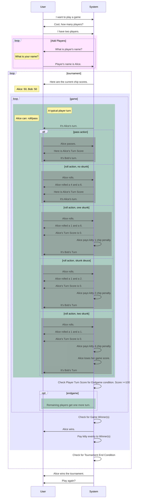

# Skunk Sequence Diagram

```mermaid
sequenceDiagram
  User->>System:I want to play a game
  System->>User:Cool, how many players?
  User->>System:I have two players.
  rect rgba(255, 0, 255, .1)
  loop Add Players
  System->>User:What is player's name?
  Note left of User: What is your name?
  User->>System:Player's name is Alice.
  end
  end
  loop tournament
  System->>User: Here are the current chip scores.
  Note left of User: Alice: 50, Bob: 50
  
  rect rgba(0, 0, 255, .1)
  
  loop game    
    rect rgba(0, 130, 15, .25)
     Note right of User: A typical player turn
     
     Note left of User: Alice can: roll/pass
     System->>User: It's Alice's turn.
     alt pass action
       rect rgba(128,128,128, .5)
        User->>System: Alice passes.
        System-->>User: Here is Alice's Turn Score
        System->>User: It's Bob's turn.
       end
     else roll action, no skunk
       rect rgba(128,128,128, .5)
         User->>System: Alice rolls.
         System-->>User: Alice rolled a 4 and a 6.
         System-->>User: Here is Alice's Turn Score
         System->>User: It's Alice's turn.
        end
     else roll action, one skunk
       rect rgba(128,128,128, .5)
         User->>System: Alice rolls.
         System-->>User: Alice rolled a 1 and a 6.
         System-->>User: Alice's Turn Score is 0.
         System->>System: Alice pays kitty 1 chip penalty.
         System->>User: It's Bob's Turn 
       end
     else roll action, skunk deuce
       rect rgba(128,128,128, .5)
         User->>System: Alice rolls.
         System-->>User: Alice rolled a 1 and a 2.
         System-->>User: Alice's Turn Score is 0.
         System->>System: Alice pays kitty 2 chip penalty.
         System->>User: It's Bob's Turn   
       end
     else roll action, two skunk
       rect rgba(128,128,128, .5)
         User->>System: Alice rolls.
         System-->>User: Alice rolled a 1 and a 1.
         System-->>User: Alice's Turn Score is 0.
         System->>System: Alice pays kitty 4 chip penalty.
         System->>System: Alice loses her game score.
         System->>User: It's Bob's Turn   
       end
     end
    end
    System->>System: Check Player Turn Score for Endgame condition.  Score >=100
    opt endgame
      rect rgba(0, 130, 15, .25)
        System-->User: Remaining players get one more turn.
      end
    end
  end
  System->>System: Check for Game Winner(s)
  System->>User: Alice wins.
  System->>System: Pay kitty evenly to Winner(s)
  end
  System->>System: Check for Tournament End Condition
  end
  System->>User: Alice wins the tournament.
  System->>User: Play again?
  
```